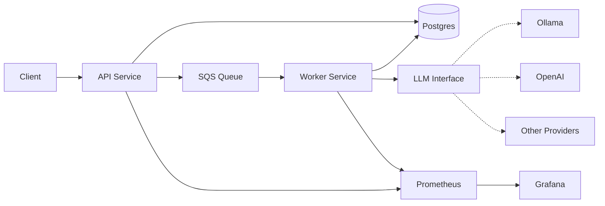

# IT Support Platform

## Overview

This project aims to be a production-standard IT incident orchestration service.
It accepts incidents via an API, processes them asynchronously using a step-based workflow.
It validates the requests, enriches the provided issue descriptions with AI-powered classification and produces human-facing support tickets.
The system provides full observability and provides idempotency guarantees for reported issues.

## Architecture

The system architecture comprises the following components:

1. **API Service**
   * Accepts an incident report via REST
   * Offloads the request to the SQS Queue
   * Acknowledges the request
2. **SQS Queue** (via LocalStack)
   * Receives messages from the API Service
3. **Worker Service**
   * Consumes messages from the SQS Queue (via polling)
   * Validates the message payload
   * Classifies the incident via the LLM Interface
   * Creates a human-facing ticket
4. **LLM Interface**
   * Interface implemented by specific LLM providers (Ollama, OpenAI etc.)
   * Classifies tickets into categories
5. **Prometheus**
   * Scrapes metrics from API and Worker services
   * Connects to Grafana as a data source
6. **Grafana**
   * Uses Prometheus as a data source
   * Provides visualisation and dashboards based on provided metrics
