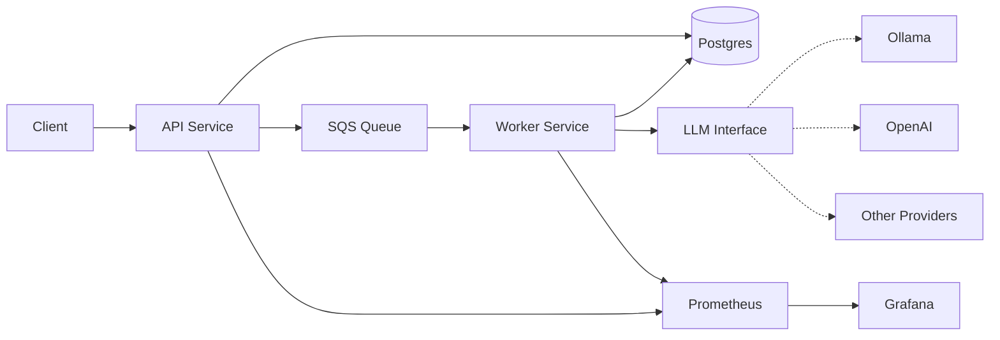
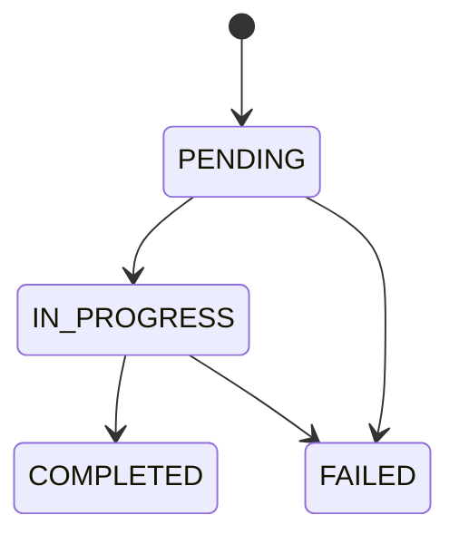
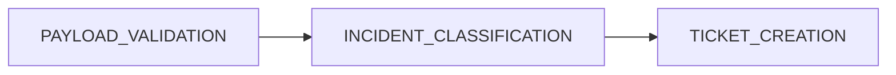
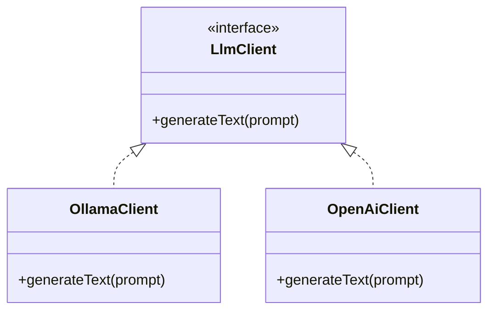

# IT Support Platform

## Overview

This project aims to be a production-standard IT incident orchestration service.
It accepts incidents via an API, processes them asynchronously using a step-based workflow.
It validates the requests, enriches the provided issue descriptions with AI-powered classification and produces human-facing support tickets.
The system provides full observability and provides idempotency guarantees for reported issues.

## Architecture

### Architecture Diagram



### System Components

The system architecture comprises the following components:

1. **API Service**
   * Accepts an incident report via REST
   * Offloads the request to the SQS Queue
   * Acknowledges the request
2. **SQS Queue** (via LocalStack)
   * Receives messages from the API Service
3. **Worker Service**
   * Consumes messages from the SQS Queue (via polling)
   * Validates the message payload
   * Classifies the incident via the LLM Interface
   * Creates a human-facing ticket
4. **LLM Interface**
   * Interface implemented by specific LLM providers (Ollama, OpenAI etc.)
   * Classifies tickets into categories
5. **Prometheus**
   * Scrapes metrics from API and Worker services
   * Connects to Grafana as a data source
6. **Grafana**
   * Uses Prometheus as a data source
   * Provides visualisation and dashboards based on provided metrics

## Workflow

### Workflow Status State Machine

These are the states a job can be in and the transitions between them.



### Workflow Steps

These are the steps a job goes through while it is in the `IN_PROGRESS` state.



### Additional Notes

* Each submission triggers one workflow run.
* The submissions are idempotent, which is enforced using an `Idempotency-Key` header that is sent along with the request.
* If a request is submitted with an `Idempotency-Key` for which a workflow has already been triggered, the existing workflow ID will be returned.

## API Design

The API service exposes the following endpoints to the client:

### `POST /incidents` (API only)

#### Request Structure

**Headers**

* `Idempotency-Key`: unique key for request deduplication

**Body**

```json
{
  "description": "Users cannot access the VPN from the London office."
}
```

#### Response Structure

**Body**

```json
{
  "workflowRunId": 123
}
```

> **Note:** If a request is submitted with an `Idempotency-Key` for which a workflow has already been triggered, the existing workflow ID associated with the provided key will be returned.

### Actuator Endpoints (API + Worker)

The following actuator endpoints are exposed by both the API and Worker services:

* `/actuator/health`
* `/actuator/info`
* `/actuator/prometheus` (scraped by Prometheus to collect metrics)

## Idempotency & Reliability

The `Idempotency-Key` header has been mentioned a few time throughout this document.

It is a concept that was largely popularised by [Stripe](https://stripe.com/) in order to prevent duplicate side effects from create/submit operations.

In this system, if a request is submitted with an `Idempotency-Key` for which a workflow has already been triggered, the existing workflow ID associated with the provided key will be returned.

This prevents duplicate tickets being opened for the same issue upon retries due to timeouts or network errors on the client.

The `Idempotency-Key` combined with the SQS ensure **at-least-once** delivery.

## AI/LLM Integration

The system is designed to use AI as part of its infrastructure via the LLM Interface component.

The component was designed to be vendor-agnostic. This was achieved using the **strategy pattern**. The intention was for the `OllamaClient` to be used locally and for the `OpenAIClient` to be used in production.


